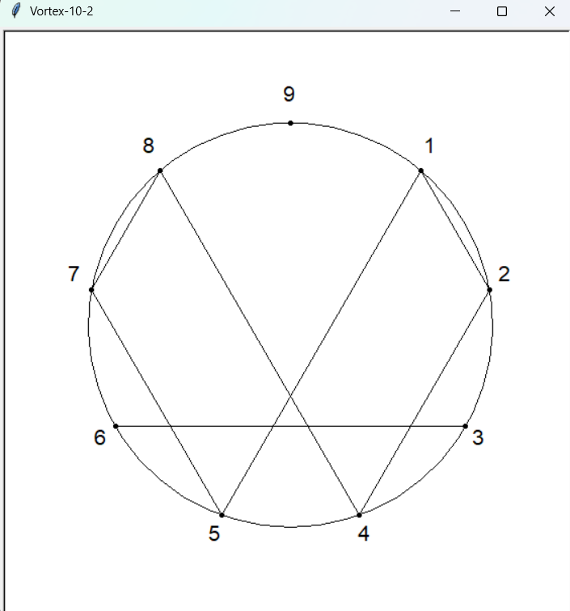
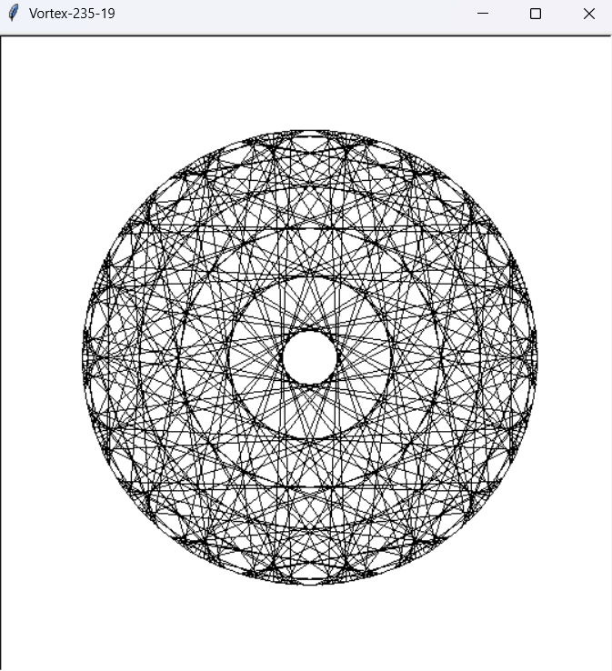
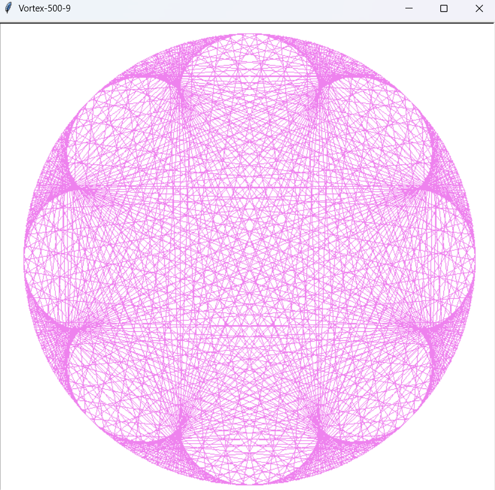

# PyVortex 🌀  
Generate beautiful, hypnotic vortex patterns using Python’s Turtle graphics, inspired by the famous **Tesla 3-6-9 vortex idea** (and the scientific debunking behind it).


## Background & Inspiration  
Nikola Tesla famously said:  
<p align="center">
  <em style="font-size: 1.1rem; color: #4a90e2">
    “If you only knew the magnificence of the 3, 6 and 9,  
    then you would have the key to the universe.”
  </em><br>
</p> 

This quote inspired a wave of online theories connecting the numbers **3, 6, and 9** with mathematical vortex patterns, often visualized by connecting points on a circle using multiplication.

While this “vortex math” is **not scientifically accurate** and widely considered **debunked pseudoscience**, the **visual patterns** it produces are fascinating from a geometric and artistic perspective.

**PyVortex** recreates these mesmerizing patterns in a simple, fully customizable Python script using Turtle graphics, perfect for learning or visual experimentation.


## Features
- Draws **multiplication-based vortex graphs**
- Fully **customizable parameters**:
  - `radius`
  - `base` (number of circle points)
  - `multiplier`
  - `color`
  - optional dots & labels
- Beginner-friendly code  
- No external libraries required  


## Examples

| Title | Image | Params | Command |
|-------|--------|---------|----------|
| **Tesla's vortex** |  | `base=10`, `multiplier=2` | `python vortex.py --base 10 --multiplier 2  --show_numbers --show_dots` |
| **Default vortex** |  | `base=235`, `multiplier=19` | `python vortex.py` |
| **Detailed colored vortex** |  | `base=500`, `multiplier=9` | `python vortex.py --radius 300 --base 500 --multiplier 9  --color violet` |


## How It Works
The algorithm:
1. Places `base` points evenly around a circle  
2. Multiplies each point index by `multiplier`  
3. Connects the point to the result modulo `base`  
4. Repeats for all points to form a vortex pattern


## Installation & Usage

Clone the repo and run:

```bash
git clone https://github.com/MAY55A/PyVortex.git
cd PyVortex

python vortex.py [-h] 
    [--radius RADIUS] 
    [--base BASE] 
    [--multiplier MULTIPLIER] 
    [--color COLOR] 
    [--show_dots] 
    [--dot_size DOT_SIZE] 
    [--show_numbers]
```

## Feedback Welcome 💬

If you try **PyVortex**, I'd love to hear your thoughts!

- Did the patterns render correctly on your machine?
- Anything confusing or missing in the usage?
- Ideas for improvements or new features?

Feel free to **open an issue**, **submit a pull request**, or simply leave a ⭐ to support the project!

## Resources & Further Reading

- [Tesla’s 3‑6‑9 and Vortex Math: Is this really the key to the universe?](https://www.youtube.com/watch?v=6ZrO90AI0c8) | A clear, math‑oriented debunking of Vortex Math by Mathologer.  
- [Vortex Based Math | The Problem Site](https://www.theproblemsite.com/vortex/) | A detailed explanation and analysis of Vortex‑based mathematics, from a skeptical and mathematical perspective.  

## License

This project is licensed under the **MIT License**.  
You are free to use, modify, and distribute it as long as the original license is included.
